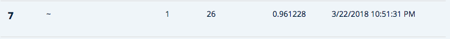
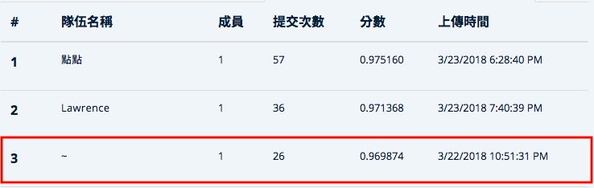

# T-brains

## my team
Public LeaderBoard  
  
Private LeaderBoard  


## data

Raw data download from [T-Brain](https://tbrain.trendmicro.com.tw/Competitions/Details/1) should put in `./query_log`, `./exception` and root folder. 

## data preprocessing
```
python data_preprocess.py #Merge log_files and fix cv folds
python general_features #Simple statistics features
python user_item_als.py #Idea from recommendation system
python dtm_als.py #Idea from NLP
python query_diff_als.py #Similar with dtm, but with time features
python merge_X.py

```
## model training
```
python train_lightgbm.py
python train_nn.py
python train_rnn.py
python ensemble.py
```

## or jupyter notebook
* antiNN.ipynb: data preprocessing + lightgbm.  
* brutalNN.ipynb: neural network only.  
* RNN.ipynb: preprocessing for RNN + RNN.  
* ensemble.ipynb: ENSEMBLE THEM ALL!!
